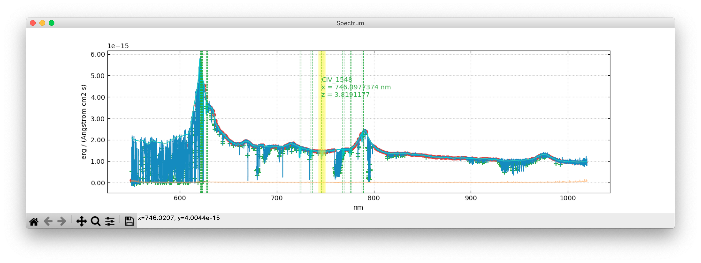

# Graphs
{: .no_toc}

Graphs are the main way to inspect and interact with the data within Astrocook. A [main plot window](graphs.md#main-graph) is shown whenever a session is loaded, while a [detail plot](graphs.md#detail-graph) will appear when a system is selected in the [system table](tables.md#system-table). The plots are handled by [matplotlib](https://matplotlib.org) and equipped with a [navigation toolbar](https://matplotlib.org/3.2.2/users/navigation_toolbar.html) to zoom in and out, pan, adjust, and save the image.

## Table of contents
{: .no_toc .text-delta }

1. TOC
{:toc}
---

## Main graph

This is an example of main graph with default elements displayed:

## Detail graph 🚧

## Interact with the plots 🚧
