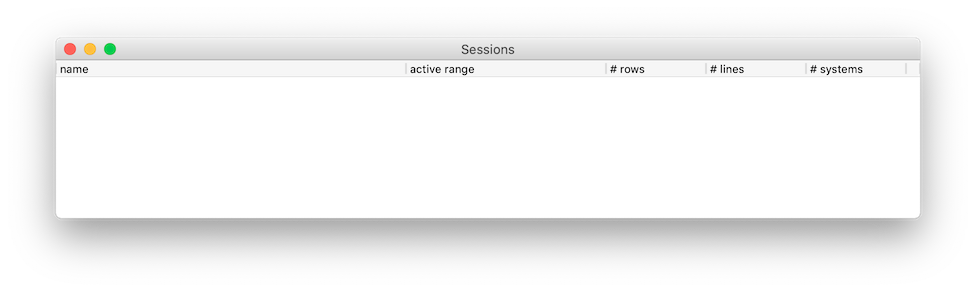
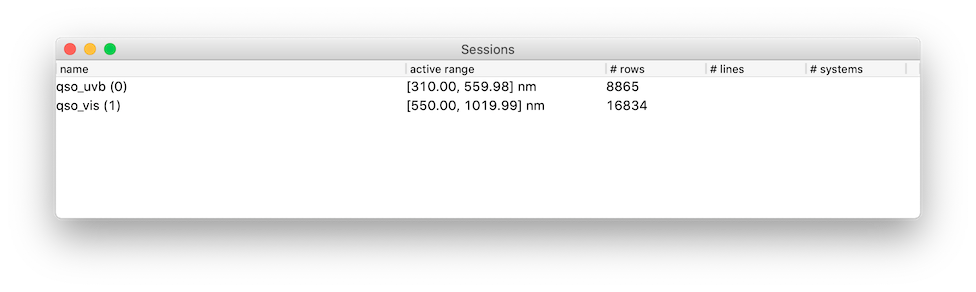
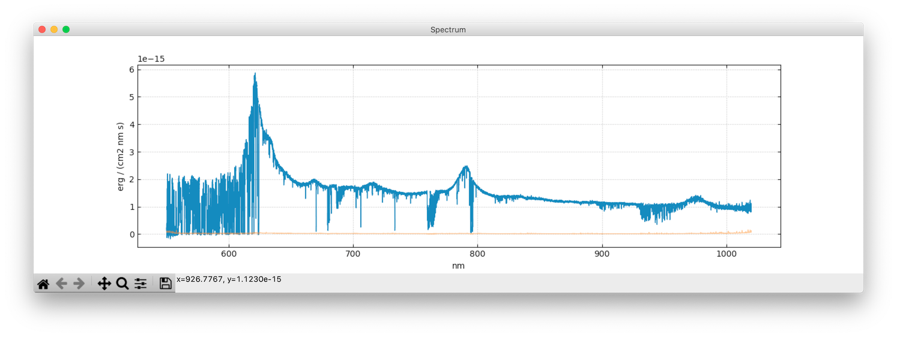
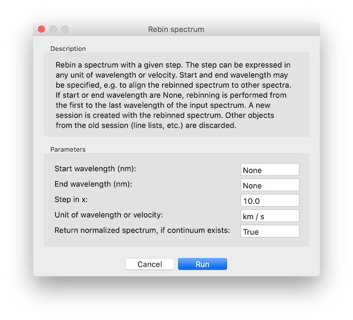

# Using the GUI
{: .no_toc}

The Graphical User Interface (GUI) is the foremost way to perform your analysis with Astrocook, letting you visually interact with the data and launch the analysis operations in the most straightforward way. The Astrocook GUI is based on [wxPython](https://www.wxpython.org/), which provides a native look-and-feel of the graphical elements across many platforms (Linux, macOS, Windows), and uses [Matplotlib](https://matplotlib.org/) for plotting.

---
## Table of contents
{: .no_toc .text-delta }

1. TOC
{:toc}
---

## Launch the GUI

To launch the Astrocook GUI:
```
$ cd /your/path/astrocook/
$ python ac_gui.py
```
This will open a blank main window:



❗️ **On some macOS systems, `python ac_gui.py` will produce an error message like this:**
```
This program needs access to the screen. Please run with a
Framework build of python, and only when you are logged in
on the main display of your Mac.
```
**If this happens, use `pythonw ac_gui.py` instead.**

❗️ **You are encouraged to add an `astrocook` command to your shell configuration. On macOS, you can type:**
```
echo "alias astrocook='pythonw /your/path/to/astrocook-1.0.0-rc.1/ac_gui.py'" >> ~/.bash_profile
```

To load data, you can choose `File > Open...` on the menu bar (`ctrl+O` or `⌘+O`, depending on the system) and browse through your file system. Alternatively, you can specify one or more paths directly at launch:
```
$ python ac_gui.py /path/to/1st_spec.fits /path/to/2nd_spec.fits
```
In this case the main window will display a list:



If the format of the data is not recognized, Astrocook will fall back on a blank window.

## Manage sessions

Each item in the main window is called a *session*. A session is created whenever a new spectrum is loaded. When you select a session on the main window, its spectrum is displayed in the plot window:



To perform the analysis, you need to select a session and access one of the several *recipes* available from the menu bar. The information extracted by the analysis is continuously attached to the selected session. This means that, e.g., a list of absorption lines is always attached to the spectrum it has been extracted from.

You can switch between sessions at any time, selecting them on the main window. When you select a session, you always retrieve the latest snapshot of the analysis, together with all the information extracted so far.

❗️ **If no session is selected and you click on the first session, it will not be selected unless you hold `ctrl` as well.**

## Use recipes

Astrocook provides you with (broadly speaking) three kinds of recipes for the analysis:

1. recipes to manipulate sessions, combining and sharing data structures among them: these are grouped in the `Edit` menu;
2. recipes to manage the plot window and the additional windows to display the data: these are grouped in the `View` menu;
3. general analysis recipes to “cook your spectrum”: these are spread between the `Recipes` menu (atomic operations and simple workflows) and the `Set menus` menu (complex workflows for specific tasks).

Typically, when you choose a recipe from the menu bar a dialog window appears. The dialog window displays a brief description of the recipe and allows you to edit the parameters.



❗️ **When you click on the `run` button in a dialog window, the whole GUI freezes until the operation is complete. You should consider this before using recipes that require long running times.**

At the beginning of the analysis, only a limited set of recipes is available from the menu bar, while others are greyed out. This happens because the greyed-out recipes require some piece of information that has not been extracted yet (e.g., to fit an absorption systems you need to detect it first). As you progresses with the analysis, more and more recipes become available.

[//]: #Some recipes allows you to create new session can be created from existing ones. E.g., when you extract a chunk from a spectrum to focus on a specific wavelength range, you actually start a new session taking the chunk as a new spectrum. The information from the original session is propagated in a smart way: e.g., only lines within the specific wavelength range are attached to the new spectrum.

[//]: #Some recipes may create data products that conflict with existing ones. E.g., the recipe to detect absorption lines may be launched twice, with different parameters. This would in principle produce two line lists for the same session, generating confusion. In this case, the GUI gives you the option to choose whether to overwrite the existing line list, or to append the new lines to it, or to start a new session altogether with the new line list.

## Save sessions

You can save a session by clicking on it on the main window and choosing `File > Save...` on the menu bar (`ctrl+S` or `⌘+S`, depending on the system).

Sessions are saved as `.acs` archives that can be directly opened by Astrocook (either with `File > Open...` or as argument of `python ac_gui.py` from the command line). `.acs` archives can also be extracted with
```
$ tar -zxvf /path/to/archive.acs
```

## Quit the GUI

You can quit Astrocook with `File > Quit...` on the menu bar (`ctrl+Q` or `⌘+Q`, depending on the system) or by closing the main window.

❗️ **When you quit Astrocook, all unsaved sessions will be lost.**
