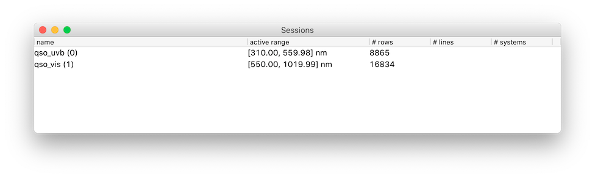
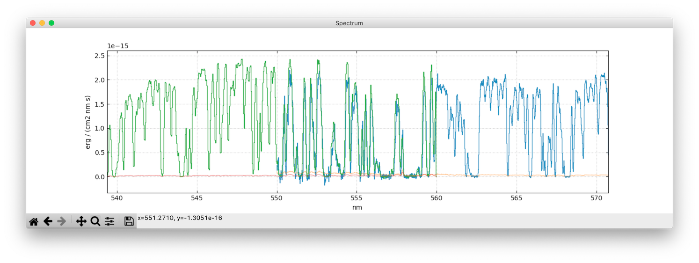
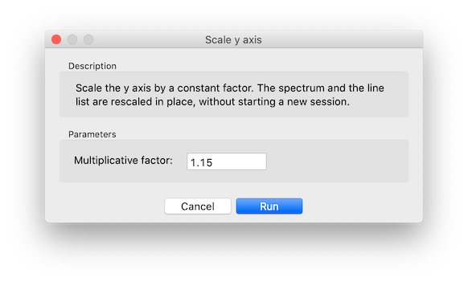
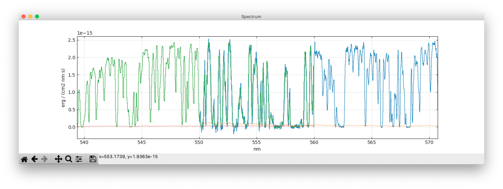
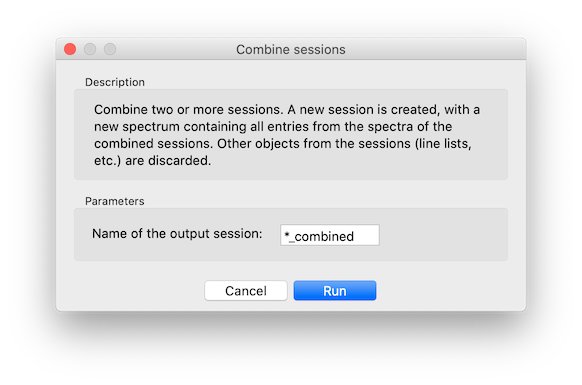
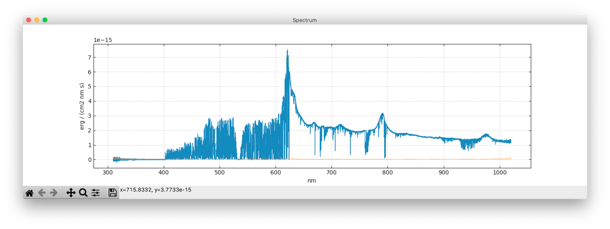

# Merging of spectra
{: .no_toc}

## Table of contents
{: .no_toc .text-delta }

1. TOC
{:toc}
---

*Merging* is what you do to combine two or more spectra into a single one. In this tutorial, you will learn how to merge two spectra with different wavelength range, like those obtained from different arms of the same instrument (in our case, VIS and NIR arm of VLT X-shooter). The same procedure can be applied to the case of several spectra with the same wavelength range.

We assume that the spectra have already been [loaded](gui.md#launch-the-gui) in Astrocook:

## Rescale the spectra

The first step is to rescale the spectra to the same flux level, to correct for inaccuracies in flux calibration. If you select both spectra by holding `ctrl` while clicking on the main window and zoom into the plot, you will see that in the VIS/NIR superposition region the flux is mismatched:

To rescale the NIR spectra to the VIS one, select it on the main window and choose `Edit > Scale y axis...`. In the dialog window, insert a suitable multiplicative factor and click on `Run`:

Selecting both spectra and zooming again, you can check that they are now matching:

You may need to rescale a spectrum several times to find a good matching.

⚠️ **Please note that the spectra are rescaled in place, without starting a new session. To undo a rescaling, you need to rescale the spectrum again with inverse factor.**

## Combine the spectra

Once spectra are rescaled, you need to create a combined session out of the individual ones. In the main window, select both sessions and choose `Edit > Combine sessions...`. You will be asked for a name for the combination:

The asterisk will be replaced by a concatenation of the selected names (`qso_NIR_qso_VIS` in this case). You can also define your own name.

On `Run`, a new session will be created:

The spectrum of this new session contains all the entries of the combined spectra. This means that the pixels of the combined spectrum may overlap with each other (as they keep their original size, defined by `xmin` and `xmax` in the spectrum table).

The same method can be of course used to combine more than two spectra.

⚠️ **When sessions are combined, only the spectra are actually combined. All other data structures are not considered.**

## Rebin the combined spectrum

It is generally useful to rebin the combined spectrum into a new wavelength grid, to avoid dealing with overlapping pixels. This is done by selecting the combined session in the main window and choosing `Recipes > Rebin spectrum...`. You will be asked to provide a step in `x` and a unit of wavelength or velocity for the output spectrum:

In this case, the spectrum will be rebinned into a grid with a fixed step of 10 km/s. The grid is designed to cover the whole wavelength range of the input spectrum. The rebinned spectrum will appear on the plot after completion:

⚠️ **Rebinning may take a long time if the grid is fine and/or the wavelength range is wide.**

You can rebin any spectrum in any session using the same procedure.

⚠️ **Please remember that the rebinning procedure interferes with the statistics of your data, as it introduces correlation among adjacent pixels. If accurate flux statistics is required, please avoid rebinning your spectra when it is not absolutely necessary.**
