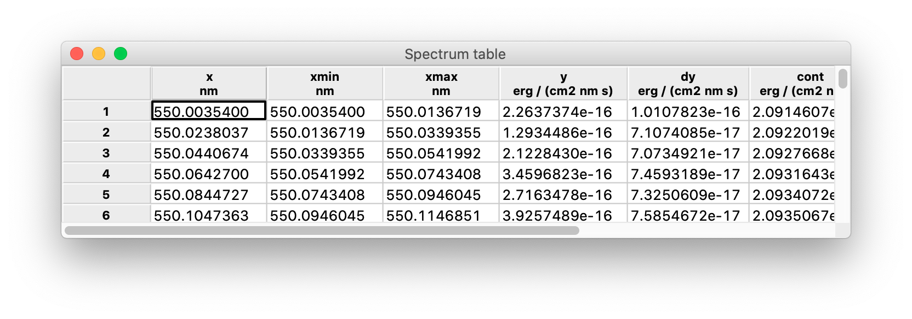
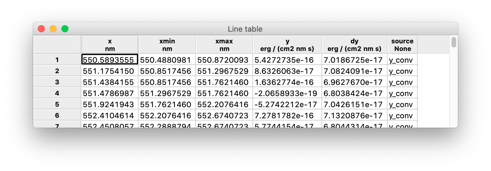
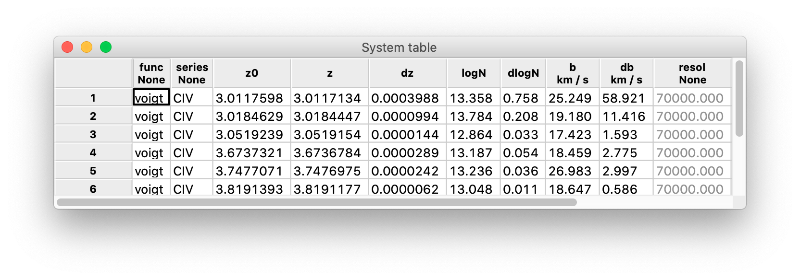

# Tables
{: .no_toc}

Spectra, line lists, and system lists can be displayed as tables. To do so, choose `View > Spectrum table`/`Line table`/`System table` from the menu bar.

❗️ **Long tables can take a long time to display.**

## Table of contents
{: .no_toc .text-delta }

1. TOC
{:toc}
---

## Spectrum table

This is an example of spectrum table:

The fundamental columns are:
- `x`: the wavelength-like independent variable;
- `xmin`, `xmax`: the interval in `x` values in which the flux-like quantity is integrated;
- `y`, `dy`: the flux-like dependent variable and its error.

The interval [`xmin`, `xmax`] is also called a *bin* (because it is the unit into which the flux information is binned) or a *pixel* (because in some cases it maps to a physical pixel in the spectrograph detector).

Other columns that frequently appear in a spectrum are:
- `y_conv`: a convolution of `y` with some smoothing kernel;
- `lines_mask`: a boolean mask of the detected lines (see [below](tables.md#line-table));
- `cont`: the spectral *continuum*, i.e. the component of `y` that remains after removing local features (e.g. absorption lines) and smoothing out noise;
- `model`: a spectral *model*, i.e. a model of both the continuum and the absorption systems (see [below](tables.md#system-table));
- `deabs`: a *deabsorbed* spectrum, i.e. an equivalent of `y` after the absorption lines have been removed using the model;
- `resol`: the spectral resolution at `x`;
- `fit_mask`: a boolean mask of the regions used to fit the model of the absorption systems.  

The spectrum table is interactive. Table cells can be edited by clicking and typing, and the new value is automatically propagated to the underlying data structure. By right-clicking on the column labels, you can:
- Sort the table by ascending or descending values of the chosen column (disabled for text columns);
- Produce a histogram of the values of the chosen column (which appears on a separate window).
By right-clicking on the row labels, you can remove rows from the table.

## Line table

This is an example of spectrum table:

The information to populate the table columns is directly extracted from the [spectrum table](tables.md#spectrum-table) where the lines have been detected:
- `x`: the line center, corresponding to the `x` value of a pixel in the spectrum;
- `xmin`, `xmax`: the boundaries of the interval covered by the line, also corresponding to the `x` values of two pixels in the spectrum;
- `y`, `dy`: values of `y` and `dy` at `x` from the spectrum;
- `source`: column of the spectrum that was used to detect the line.

Please note that in this case [`xmin`, `xmax`] do not map to a single pixel in the spectrum, but to a range of pixels.

Lines are not typically detected on the raw `y` column of the spectrum, because in general the noise on `y` makes it very hard to discriminate between legitimate lines and random fluctuations. This is the reason for keeping track of the `source` of the detected lines. A typical `source` value is `y_conv`, i.e. a convolution of the `y` column of the spectrum with some smoothing kernel (see [above](structures.md#spectra)) but it may be any other column.

The line table is interactive too, much like the [spectrum table](tables.md#spectrum-table).

## System table

When you [detect absorption systems](absorbers.md), they are also formatted into a table added to the session. This is an example:

The table contains the information to model the absorption systems:
- `func`: the function used to define the model (currently, only the Voigt function `voigt` is available);
- `series`: the list of ionic transitions that are modeled;
- `z0`: the starting redshift, typically computed from the `x` value of one or more [absorption lines](tables.md#line-table);
- `z`, `dz`: the redshift of the model and its error;
- `logN`, `dlogN`: the base-10 logarithm of the column density used in the Voigt function (in cm^-2) and its error;
- `b`, `db`: the Doppler broadening $$b$$ and its error;
- `resol`: the resolution adopted by the model;
- `chi2r`: the reduced chi-squared between the model and the data;
- `id`: the identification number of the model.

The parameters of the [Voigt profile](absorbers.md#voigt-profile-modeling) (`z`, `logN`, and `b`) may be either guess or fitted parameters. As a rule, when a system is added to the list it is also fitted to the spectrum: `z`, `logN`, and `b` are the best-fit values and `chi2r` gives an estimation of the goodness of fit.

The system table is interactive, and allows for additional actions compared to [spectrum table](tables.md#spectrum-table) and the [line table](tables.md#line-table).

First and foremost, you can click on the row label of a system to display a detail plot of the system itself (see [here](graphs.md#detail-graph) for more details). When you do so, the selected system is highlighted by a light blue background, together with all the systems in its group (i.e. the systems that need to be modeled together with the selected one).

The model parameters in columns `z`, `logN`, `b`, and `resol` can be constrained from the table:
- by right-clicking on a cell, you can “freeze” the parameter, i.e. prevent it from varying when the model is fitted again (you can also freeze an entire column by right-clicking on its label);
- by selecting two or more cells and right-clicking on one of them, you can “link” the parameters, i.e. force them to have equal values when the model is fitted again;
- in column `b`, you can link two or more cells also by temperature: in this case, not the Doppler broadenings $$b$$ but the associated temperatures $$T$$ are kept equal (assuming the broadening is fully due to thermal motions).
Frozen parameters are shown in gray, while linked parameters are shown in matching colors. When two or more parameters are linked, the value of the first one is propagated to the other(s): be sure to adjust it beforehand, if needed.

By right-clicking on the row labels of a [system table](tables.md#system-table) you can also:
- fit the model to the system, either with one click or opening the recipe dialog to adjust the fitting parameters;
- compute the cross-correlation between data and model, and find the shift along `x` that maximizes it;
- improve all models by automatically adding more components.
