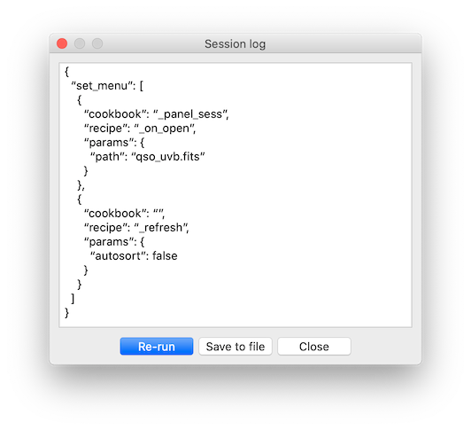
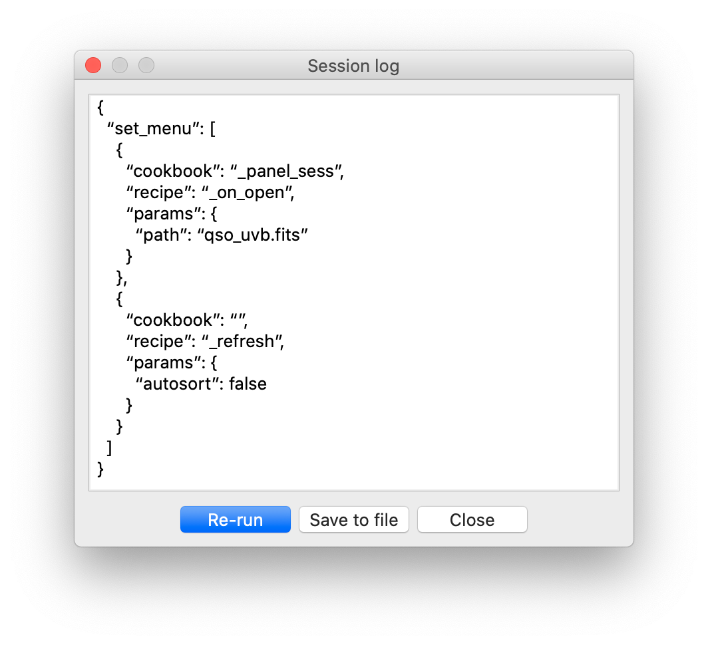

# Managing workflows
{: .no_toc}

## Table of contents
{: .no_toc .text-delta }

1. TOC
{:toc}
---

## Logging

Astrocook is equipped with a built-in logging tool, to keep track of the analysis as it is performed. Recipe calls and other relevant actions are organized into a *workflow* which is continuously recorded in JSON format for later reference.

Each session is logged separately. To visualize the current log of a session, select it on the main window and choose `View > Session log`:

Like the example above, every workflow starts with a call to recipe [`GUIPanelSess._on_open`](general_cb.md#open-session) (which opens a new session) and ends with a call to recipe [`GUI._refresh`](general_cb.md#refresh-the-gui) (which refreshes the GUI to reflect any change in the data). Other recipes are inserted between these two, with all their relevant parameters:

Through the `Session log` window, you can:

* inspect and adjust the JSON script;
* re-run the workflow from the start, possibly omitting some steps (useful to correct mistakes or "undo" the last operation);
* save the workflow to re-execute it later.

Logs are saved as `.json` files by clicking on the `Save` button. Like `.acs` archives, `.json` files can be directly opened by Astrocook (either with `File > Open...` or as argument of `python ac_gui.py` from the command line). When a `.json` file is opened, the log is used to re-build the session from scratch.

Workflows follow a strict inheritance rule: when a new session is created, it is assigned the full log of the procedure that brought to its creation. This happens when a recipe spawns a new session, or when a session is opened from a previously saved `.json` file. In this way, the new session is totally independent from its source, and its log can be saved again in its entirety, without reference to a previously saved `.json` file.

Workflows can be re-run at any moment, either by clicking on the `Re-run` button in the `Session log` window, or by right-clicking on the session list and choosing `Re-run`. When this is done, the session is destroyed and re-built from scratch using its log. If the workflow included recipes spawning new sessions, these are also re-built.

## Scripting
You can of course create your own workflows outside of Astrocook, following the same JSON syntax used by the automatic log tool. The cookbook with all the current recipes and their parameters is available [here](cookbook.md). To use a recipe, you can copy-paste the JSON template and put proper parameter values instead of defaults and XXX placeholders.

Shell scripting can be effectively used to create and/or edit JSON files at runtime and feed them to Astrocook. This may be useful, for instance, to run the same workflow on different input data, possibly with different parameters.

Not all custom-made workflows are guaranteed to run smoothly on Astrocook. When writing your JSON script, please adhere to the following rules:

* the workflow must start with a call to [`GUIPanelSess._on_open`](general_cb.md#open-session) and must end with a call to [`GUI._refresh`](general_cb.md#refresh-the-gui);
* whenever a recipe spawn a new session, all subsequent recipes are run on the new session; to continue running recipes on the previous session, you must write a separate workflow.

It is a good practice to design a workflow through the GUI first, and use the automatic log generated by Astrocook as a template for custom-made workflows.
