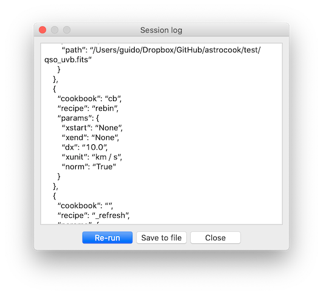

# Managing workflows
{: .no_toc}

## Table of contents
{: .no_toc .text-delta }

1. TOC
{:toc}
---

## Logging

Astrocook is equipped with a built-in logging tool, to keep track of the analysis as it is performed. Recipe calls and other relevant actions are organized into a *workflow* which is continuously recorded in JSON format for later reference.

Each session is logged separately. To visualize the current log of a session, select it on the main window and choose `View > Session log`:

Like the example above, all workflows begin by opening a session and end by refreshing the GUI (to reflect any change in the data being visualized). Other actions are inserted between these two, with all their relevant parameters:

Through the `Session log` window, you can:

* inspect and adjust the JSON script;
* re-run the workflow from the start, possibly omitting some steps (useful to correct mistakes or "undo" the last operation);
* save the workflow to re-execute it later.

Logs are saved as `.json` files by clicking on the `Save` button. Like `.acs` archives, `.json` files can be directly opened by Astrocook (either with `File > Open...` or as argument of `python ac_gui.py` from the command line). When a `.json` file is loaded, the log is used to re-build the session from scratch.

Workflows follow a strict inheritance rule: when a new session is created, it is assigned the full log of the procedure that brought to its creation. This happens when a recipe spawns a new session, or when a session is loaded from a previously saved `.json` file. In this way, the new session is totally independent from its source, and its log can be saved again in its entirety.

Workflows can be re-run at any moment, either by clicking on the `Re-run` button in the `Session log` window, or by right-clicking on the session list and choosing `Re-run`. When this is done, the session is destroyed and re-built from scratch using its log. If the workflow included recipes spawning new sessions, these are also re-built.

## Scripting 🚧
